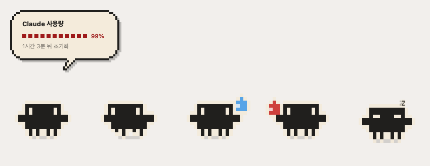
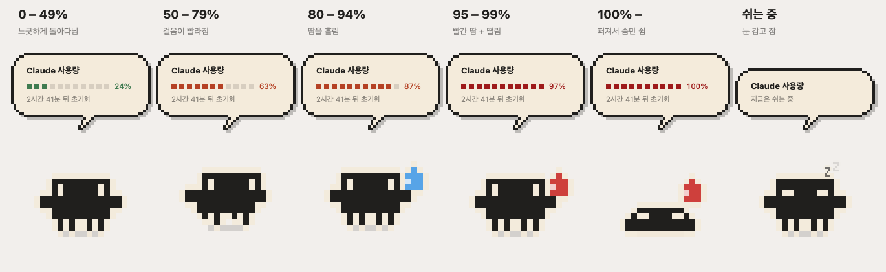

# claude-usage-buddy

맥 바탕화면을 돌아다니는 도트 마스코트가 **Claude Code 사용량**을 알려줍니다.
클릭하면 말풍선으로 지금 얼마나 썼는지 보여주고, 많이 쓰면 표정이 바뀌고 알림도 보냅니다.



> 위 그림은 표정을 한 장에 모아 찍은 것입니다. 실제로 화면에 떠 있는 마스코트는 **한 마리**입니다.

---

## 빠른 시작

### 받아서 바로 쓰기 (터미널 없음)

1. [**최신 릴리스**](https://github.com/heyoni/claude-usage-buddy/releases/latest)에서 `Claude-Usage-Buddy-<버전>-arm64.zip` 을 받습니다.
2. 압축을 풀고 **Claude Usage Buddy.app** 을 `응용 프로그램` 폴더로 옮깁니다.
3. 처음 한 번은 아이콘을 **우클릭 → 열기** 로 실행합니다. (아래 참고)

바탕화면 오른쪽 아래에 마스코트가 나타납니다. 파이썬 설치도, 터미널도 필요 없습니다.

> **처음 열 때 "확인되지 않은 개발자" 경고가 뜹니다.**
> Apple 개발자 서명이 없어서 그렇습니다. 더블클릭 대신 **우클릭 → 열기** 를 누르면 "열기" 버튼이 나옵니다.
> 한 번만 그렇게 열면 다음부터는 더블클릭으로 됩니다.
> 그래도 안 되면 `시스템 설정 → 개인정보 보호 및 보안` 맨 아래의 "그래도 열기" 를 누르세요.

> Apple Silicon(M1 이후) 맥용입니다. Intel 맥은 아래 "클론해서 쓰기" 로 설치하세요.

### 클론해서 쓰기 (터미널 명령도 쓰려면)

```bash
git clone https://github.com/heyoni/claude-usage-buddy.git
cd claude-usage-buddy
./install.sh
claude-usage-buddy
```

`claude-usage-buddy --cli` 같은 터미널 명령을 쓰고 싶거나, Intel 맥이거나, 코드를 고치고 싶을 때 이 방법을 씁니다.
이 방법도 `~/Applications` 에 더블클릭용 앱을 같이 만들어 줍니다.

### 쓰는 법

| 하고 싶은 것 | 방법 |
| --- | --- |
| 지금 얼마나 썼는지 보기 | 마스코트를 **클릭** |
| 계속 띄워 두고 보기 | 마스코트를 **꾹 누르기** |
| 자리 옮기기 | **드래그** |
| 크기 바꾸기 / 끄기 | **우클릭** → 메뉴 |
| Claude Code 켤 때 같이 띄우기 | **우클릭** → "Claude Code 켤 때 같이 띄우기" |
| 맥 켤 때마다 자동으로 띄우기 | **우클릭** → "로그인 시 자동 실행" |
| 퍼센트를 실제 값에 맞추기 | **우클릭** → "눈금 맞추기…" |
| 터미널에서 숫자만 보기 | `claude-usage-buddy --cli` (클론 설치 시) |

퍼센트가 Claude Code 가 알려주는 값과 다르다면
[눈금 맞추기](#눈금-맞추기)를 한 번 해 주세요. 이유도 거기 적어 두었습니다.

---

## 왜 만들었나

Claude Code 의 사용 한도는 **5시간짜리 창(블록)** 단위로 돌아옵니다. 그런데 지금 그 창을
얼마나 썼는지 확인하려면 매번 터미널에서 명령을 쳐야 하고, 한참 몰입해 일하다 보면
한도에 부딪히고 나서야 알게 됩니다.

이 앱은 그 숫자를 **바탕화면에 상주시킵니다.** 마스코트가 땀을 흘리기 시작하면
슬슬 아껴 쓸 때고, 퍼져 있으면 이미 다 쓴 겁니다. 굳이 클릭하지 않아도 곁눈질로 알 수 있습니다.

---

## 사용량별 모습



| 5시간 블록 사용률 | 모습 |
| --- | --- |
| 0 – 49% | 느긋하게 돌아다닙니다 |
| 50 – 79% | 걸음이 빨라집니다 |
| 80 – 94% | 땀을 흘립니다 |
| 95 – 99% | 빨간 땀을 흘리며 덜덜 떱니다 |
| 100% 이상 | 납작하게 퍼져 숨만 쉽니다. 이 동안엔 움직이지 않습니다 |
| (사용률과 무관) | 20분 넘게 요청이 없으면 **졸기** 시작합니다. 자는 동안엔 돌아다니지 않습니다 |

실제로 움직이는 모습을 보려면:

```bash
# 4초마다 차례로 돌려 보기
claude-usage-buddy --demo cycle

# 한 가지 상태로 고정
claude-usage-buddy --demo exhausted
```

---

## 클론해서 설치하기 (자세히)

**요구 사항**: macOS, Python 3.10 이상. Claude Code 를 한 번이라도 쓴 적이 있어야 합니다.
릴리스 zip 으로 받았다면 이 섹션은 건너뛰어도 됩니다.

```bash
git clone https://github.com/heyoni/claude-usage-buddy.git
cd claude-usage-buddy
./install.sh
```

`install.sh` 가 하는 일:

- `~/.claude-usage-buddy/venv` 에 가상환경을 만들고 의존성(PyObjC)을 설치합니다
- 그 안에 이 패키지를 설치해 `claude-usage-buddy` 명령을 만듭니다
- `~/.local/bin` 에 링크를 걸어 어느 폴더에서든 이름만으로 실행되게 합니다
- `~/Applications/Claude Usage Buddy.app` 을 만듭니다 — 런치패드·Spotlight 에서 더블클릭으로 실행

시스템 파이썬은 건드리지 않습니다.

### 띄우는 방법 세 가지

원하는 걸 골라 쓰세요. 여러 개 켜 둬도 마스코트는 한 마리만 뜹니다.

| 방법 | 언제 뜨나 | 설정 |
| --- | --- | --- |
| 앱 더블클릭 | 내가 켤 때 | 설치하면 바로 됨 |
| Claude Code 연동 | `claude` 를 켤 때마다 | 우클릭 메뉴, 또는 `./install.sh --hook` |
| 로그인 시 자동 실행 | 맥을 켤 때마다 | 우클릭 메뉴, 또는 `./install.sh --autostart` |

터미널에서는 `claude-usage-buddy` 로도 뜹니다.
`~/.local/bin` 이 PATH 에 없다면 셸 설정에 `export PATH="$HOME/.local/bin:$PATH"` 를 넣으세요.

**Claude Code 연동**은 `~/.claude/settings.json` 의 `hooks.SessionStart` 에 항목을 하나 넣습니다.
기존 훅은 건드리지 않고, 이미 켜 둔 세션에는 적용되지 않습니다 (다음 세션부터).

**로그인 시 자동 실행**은 `~/Library/LaunchAgents/com.github.claude-usage-buddy.plist` 를 등록합니다.

전부 되돌리려면 `./uninstall.sh`. 설정과 색인, 가상환경까지 지우려면 `rm -rf ~/.claude-usage-buddy`.

---

## 조작

| 동작 | 결과 |
| --- | --- |
| 클릭 | 말풍선 열기 (3초 뒤 스르륵 사라짐) / 닫기 |
| 꾹 누르기 (0.8초) | 말풍선 고정 — 다시 누를 때까지 계속 떠 있습니다 |
| 드래그 | 원하는 자리로 옮기기 (위치가 저장됩니다) |
| 우클릭 | 메뉴 — 사용량 보기, 새로고침, 크기, 돌아다니기, Claude Code 연동, 자동 실행, 눈금 맞추기, 설정 열기, 종료 |

말풍선은 다른 모니터로 포커스가 옮겨가거나 데스크탑(스페이스)을 전환하면 닫힙니다.
크기는 우클릭 메뉴에서 5단계로 바꿀 수 있고, 재시작 없이 바로 반영됩니다.

마스코트는 자기가 올라가 있는 화면에 머뭅니다. 다른 모니터로 옮기려면 드래그하세요.

---

## 5시간 블록이 뭔가요

Claude Code 의 사용 한도는 하루 단위가 아니라 **5시간짜리 창** 단위로 돌아옵니다.
처음 요청을 보낸 시각부터 5시간이 지나면 그 창은 닫히고 사용량은 0 부터 다시 셉니다.
그래서 "지금 더 써도 되는지" 를 판단할 때 의미 있는 단위는 오늘 총합이 아니라 이 창입니다.

말풍선의 퍼센트와 "○○ 뒤 초기화" 는 모두 이 창을 기준으로 합니다.

블록은 그 세션 첫 요청 시각을 정시로 내린 지점에서 시작합니다.
09:20 에 시작했다면 블록은 **09:00 ~ 14:00** 입니다.

---

## 사용량은 어디서 가져오나요

Claude Code 는 요청마다 `~/.claude/projects/**/*.jsonl` 에 모델명·토큰 수·시각을 남깁니다.
이 앱은 **그 파일만 읽습니다.** 네트워크 통신도, API 키도, 로그인도 필요 없습니다.
읽은 내용이 이 맥 밖으로 나가지 않습니다.

### 두 가지는 추정치입니다

**1. 금액은 API 정가 환산값입니다.**
Pro/Max 구독으로 쓰고 있다면 실제 청구 금액이 아니라 "같은 양을 API 로 썼다면 얼마" 라는 뜻입니다.
모델별 단가는 [Anthropic 공식 가격](https://www.anthropic.com/pricing)을 따르고,
캐시 쓰기는 입력 단가의 1.25배(5분)/2배(1시간), 캐시 읽기는 0.1배로 계산합니다.

**2. 사용률의 분모도 추정치입니다.**
서버가 강제하는 실제 한도는 로컬에 남지 않습니다. 그래서 기본값은
*지금까지 가장 많이 쓴 5시간 블록* 을 100% 로 잡습니다.
당연히 Claude Code 가 알려주는 퍼센트와 다를 수 있습니다.

#### 눈금 맞추기

Claude Code 에서 `/usage` 로 실제 퍼센트를 확인한 뒤, 그 숫자를 알려 주면 기준을 역산해 저장합니다.
마스코트를 **우클릭 → "눈금 맞추기…"** 에 숫자를 넣으면 됩니다. 터미널에서는:

```bash
# Claude Code 가 90% 라고 할 때
claude-usage-buddy --calibrate 90
```

```
현재 블록 환산 비용  $17.10
이걸 90% 로 보면  100% = $19.00

기준을 저장했습니다: ~/.claude-usage-buddy/config.json
다음 갱신(최대 1분)부터 마스코트에 반영됩니다.
```

이후로는 두 숫자가 비슷하게 움직입니다. 다만 Anthropic 의 한도는 금액이 아니라 자체
가중치로 계산되므로, 캐시 읽기와 출력의 비율이 평소와 크게 달라지면 다시 벌어질 수 있습니다.
그때 다시 `--calibrate` 하면 됩니다.

---

## 터미널에서 보기

말풍선에는 지금 블록만 나옵니다. 금액·토큰 수와 하루·주 단위 합계는 CLI 에 있습니다.

```bash
$ claude-usage-buddy --cli
Claude 사용량
────────────────────────────────────────
5시간 블록   ███████████████░░░░░░░░░ 65%
             $12.40 · 14.2M tok
             2시간 7분 남음 (기준 $19.00)
────────────────────────────────────────
오늘         $21.80 · 25.6M tok
최근 7일     $96.30 · 112.4M tok
오늘 모델    Opus 5 82%, Sonnet 5 18%

* 금액은 API 정가 환산 추정치입니다 (구독 실제 청구액 아님)
```

`--json` 은 같은 내용을 기계가 읽기 좋은 형태로 뱉습니다.
상태 표시줄이나 다른 도구에 물릴 때 쓰세요.

```bash
$ claude-usage-buddy --json
{
  "block": { "percent": 65.0, "cost_usd": 12.40, "tokens": 14200000,
             "limit_usd": 19.00, "remaining_seconds": 7620, "active": true },
  "today": { "cost_usd": 21.80, "tokens": 25600000 },
  "week":  { "cost_usd": 96.30, "tokens": 112400000 },
  "idle_seconds": 22, "dozing": false, "mood": "busy"
}
```

### 명령 전체

| 명령 | 하는 일 |
| --- | --- |
| `claude-usage-buddy` | 마스코트 실행 |
| `claude-usage-buddy --cli` | 터미널에 사용량 출력 |
| `claude-usage-buddy --json` | JSON 으로 출력 |
| `claude-usage-buddy --calibrate <퍼센트>` | 실제 사용률에 눈금 맞추기 |
| `claude-usage-buddy --demo <표정>` | 표정 고정 (`cycle` 이면 순환) |
| `claude-usage-buddy --install-app` / `--uninstall-app` | 더블클릭용 앱 만들기 / 지우기 |
| `claude-usage-buddy --install-hook` / `--uninstall-hook` | Claude Code 연동 / 해제 |
| `claude-usage-buddy --install-agent` / `--uninstall-agent` | 로그인 시 자동 실행 / 해제 |

---

## 알림

블록 사용률이 정해진 퍼센트를 넘을 때 한 번씩, 그리고 새 블록이 시작될 때 알립니다.
macOS 알림 센터를 씁니다. 처음 한 번 알림 권한을 물어볼 수 있습니다.

기본값은 50 / 80 / 95 / 100% 입니다.

---

## 설정

`~/.claude-usage-buddy/config.json` 을 고치면 됩니다.
우클릭 메뉴의 "설정 파일 열기" 로도 열 수 있습니다.

```jsonc
{
  "refresh_seconds": 60,        // 사용량 다시 읽는 주기
  "block_hours": 5,             // 사용 블록 길이
  "block_cost_limit": null,     // 100% 기준 금액. null 이면 자동 추정
  "doze_after_minutes": 20,     // 이만큼 요청이 없으면 졸기 시작. 0 이면 안 졺
  "retention_days": 30,         // 트랜스크립트 보관 기간

  "notify": {
    "enabled": true,
    "thresholds": [50, 80, 95, 100],  // 이 퍼센트를 넘을 때 한 번씩 알림
    "on_block_reset": true            // 새 블록 시작을 알림
  },

  "mascot": {
    "scale": 1.0,               // 크기 배율 (우클릭 메뉴에서도 바로 바꿀 수 있음)
    "speed": 1.0,               // 걷는 속도
    "wander": true,             // false 면 제자리에 있음
    "position": null,           // 마지막 위치 [x, y]. 드래그하면 기록됨
    "bubble_seconds": 3         // 말풍선이 저절로 닫히는 시간. 0 이면 안 닫힘
  }
}
```

대부분은 다시 실행해야 반영됩니다. `block_cost_limit` 만 예외로,
갱신할 때마다 파일에서 다시 읽으므로 `--calibrate` 결과가 즉시 적용됩니다.

---

## 구조

```
buddy/
├── usage.py      트랜스크립트 증분 색인 + 블록·일·주 집계
├── pricing.py    모델별 단가표와 비용 환산
├── sprite.py     도트 마스코트 그리기와 애니메이션
├── bubble.py     말풍선 도안과 레이아웃
├── app.py        창·이동·클릭·메뉴 (AppKit)
├── notify.py     알림 센터 알림
├── autostart.py  LaunchAgent 등록
├── hook.py       Claude Code SessionStart 훅 등록
├── appbundle.py  더블클릭용 .app 번들과 아이콘 생성
├── single.py     중복 실행 방지
├── bundle.py     독립 실행 앱 안에서 도는지 판별
└── cli.py        터미널 출력
packaging/
├── build.sh      독립 실행 앱(.app)과 배포용 zip 빌드
└── setup.py      py2app 설정
tools/
├── render_preview.py   표정 미리보기 PNG
└── render_states.py    사용량 구간별 PNG
tests/
├── test_sprite_frames.py   도안이 상태·방향에 따라 어긋나지 않는지
└── test_bubble_flow.py     말풍선이 뜨고 사라지는 흐름
```

### 색인

첫 실행 때 `~/.claude/projects` 를 한 번 훑어 `~/.claude-usage-buddy/index.json` 에
색인을 만듭니다. 이후에는 파일별로 **새로 늘어난 바이트만** 읽습니다.
370MB 짜리 기록에서도 갱신이 1초 안쪽입니다.

세션을 이어받거나 분기하면 같은 요청이 여러 파일에 복사되므로,
요청 ID 로 중복을 걸러냅니다.

### 배포용 앱 만들기

```bash
./packaging/build.sh
```

`py2app` 으로 파이썬과 PyObjC 를 통째로 넣은 `.app` 을 만들고 `dist/` 에 zip 으로 묶습니다.
빌드한 맥과 같은 아키텍처(Apple Silicon 이면 arm64)에서만 돕니다.
서명과 공증은 하지 않으므로, 받은 사람은 처음 한 번 우클릭 → 열기 로 실행해야 합니다.

### 그림

마스코트와 말풍선 모두 이미지 파일 없이 **코드로 칸을 찍어** 그립니다.
안티에일리어싱을 끄고 칸 크기와 창 위치를 정수로 맞춰서, 어느 배율에서도 도트가 뭉개지지 않습니다.
말풍선의 테두리는 도안을 한 칸 깎아낸 안쪽 면을 덧칠해 만듭니다.

---

## 알려진 제약

- **macOS 전용**입니다. AppKit 을 직접 씁니다.
- 서버가 주는 실제 rate limit 잔량은 로컬에 없어서, 사용률은 어디까지나 추정입니다
  (위의 눈금 맞추기 참고).
- 알림은 `osascript` 를 씁니다.
- 릴리스 앱은 Apple 개발자 서명이 없어 처음 열 때 우클릭 → 열기 가 필요합니다. 서명에는 연간 개발자 계정이 필요해 아직 하지 않았습니다.
- 마스코트는 항상 다른 창 위에 뜹니다. 전체 화면 앱 위에서는 가려질 수 있습니다.

---

## 라이선스

MIT

---

이 프로젝트는 Anthropic 과 무관한 개인 프로젝트입니다.
